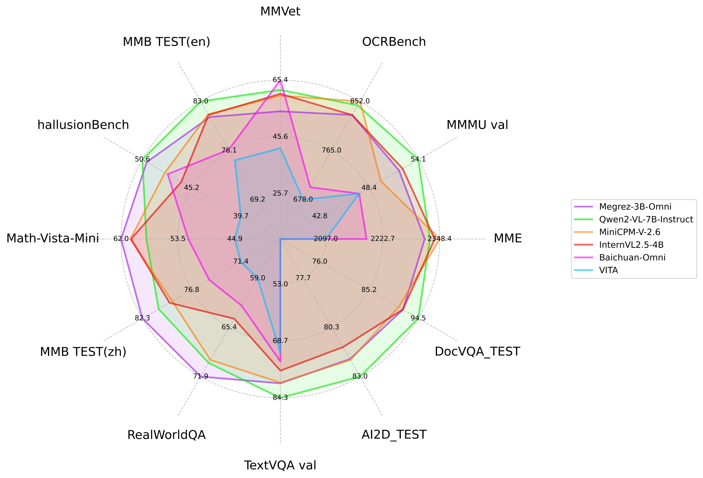
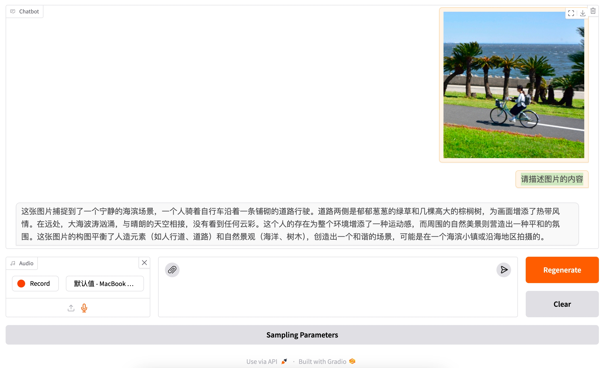

<div align="center">

# Megrez-3B-Omni: The First Open-Source End-Side Full Modality Understanding Model

<p align="center">
    
<p>
<p align="center">
    🤗 <a href="https://huggingface.co/Infinigence/Megrez-3B-Omni">Huggingface</a>&nbsp&nbsp | &nbsp&nbsp🤖<a href="https://www.modelscope.cn/models/InfiniAI/Megrez-3B-Omni">Modelscope</a>&nbsp&nbsp | &nbsp&nbsp🖥️ <a href="https://huggingface.co/spaces/Infinigence/Megrez-3B-Omni">Demo</a>&nbsp&nbsp | &nbsp&nbsp📖 <a href="assets/wechat-official.jpg">WeChat Official</a>&nbsp&nbsp | &nbsp&nbsp💬 <a href="assets/wechat-group.jpg">WeChat Groups</a>&nbsp&nbsp
</p>

<strong>[中文](./README_zh.md) | English</strong>

</div>

## Introduction
**Megrez-3B-Omni** is an on-device multimodal understanding LLM model developed by **Infinigence AI** ([Infinigence AI](https://cloud.infini-ai.com/platform/ai)). It is an extension of the Megrez-3B-Instruct model and supports analysis of image, text, and audio modalities. The model achieves state-of-the-art accuracy in all three domains:
- Image Understanding: By utilizing SigLip-400M for constructing image tokens, Megrez-3B-Omni outperforms models with more parameters such as LLaVA-NeXT-Yi-34B. It is one of the best image understanding models among multiple mainstream benchmarks, including MME, MMMU, and OCRBench. It demonstrates excellent performance in tasks such as scene understanding and OCR.
- Language Understanding: Megrez-3B-Omni retains text understanding capabilities without significant trade-offs. Compared to its single-modal counterpart (Megrez-3B-Instruct), the accuracy variation is less than 2%, maintaining state-of-the-art performance on benchmarks like C-EVAL, MMLU/MMLU Pro, and AlignBench. It also outperforms previous-generation models with 14B parameters.
- Speech Understanding: Equipped with the encoder head of Qwen2-Audio/whisper-large-v3, the model supports both Chinese and English speech input, multi-turn conversations, and voice-based questions about input images. It can directly respond to voice commands with text and achieved leading results across multiple benchmarks.

## Evaluation

- The left image compares the performance of Megrez-3B-Omni with other open-source models on mainstream image multimodal tasks.
- The right image shows the performance of Megrez-3B-Omni on the OpenCompass test set. Image reference: [InternVL 2.5 Blog Post](https://internvl.github.io/blog/2024-12-05-InternVL-2.5/).  

You can find detailed accuracy metrics on the [Megrez-3B-Omni-HF](https://huggingface.co/Infinigence/Megrez-3B-Omni) page.  

<div style="display: flex; justify-content: space-between;">
  
  
</div>

### Inference Speed

|                | image_tokens | prefill (tokens/s) | decode (tokens/s) |
|----------------|:------------:|:------------------:|:-----------------:|
| Megrez-3B-Omni |      448     |       6312.66      |       1294.9      |
| Qwen2-VL-2B    |     1378     |       7349.39      |       685.66      |
| MiniCPM-V-2_6  |      448     |       2167.09      |       452.51      |

Setup:  
- The testing environment utilizes an NVIDIA H100 GPU with vLLM. Each test includes 128 text tokens and a 720×1480 image as input, producing 128 output tokens, with `num_seqs` fixed at 8.  
- Under this setup, the decoding speed of Qwen2-VL-2B is slower than Megrez-3B-Omni, despite having a smaller base LLM. This is due to the larger number of image tokens generated when encoding images of the specified size, which impacts actual inference speed.  

## Model Demo

【GIF】

## Install

Install runtime dependencies with the following command:

```shell
pip install -r requirements.txt
```

The audio-related functionality relies on **FFmpeg** for audio processing. If you are using a Debian or Debian-based system, you can install FFmpeg with the following command:

```bash
sudo apt-get install ffmpeg
```

For other operating systems, please refer to the [official FFmpeg documentation](https://ffmpeg.org/download.html) for installation instructions.

## Inference

### Conversation with Multimodal Data

You can use the following script to chat with our model. Note that you should replace `PATH_TO_PRETRAINED_MODEL` with the path to the downloaded model checkpoint.

```python
import torch
from transformers import AutoModelForCausalLM

path = "{{PATH_TO_PRETRAINED_MODEL}}"  # Change this to the path of the model.

model = (
    AutoModelForCausalLM.from_pretrained(
        path,
        trust_remote_code=True,
        torch_dtype=torch.bfloat16,
    )
    .eval()
    .cuda()
)

messages = [
    {
        "role": "user",
        "content": {
            "text": "Please describe the content of the image.",
            "image": "./data/sample_image.jpg",
        },
    },
]

MAX_NEW_TOKENS = 100
response = model.chat(
    messages,
    sampling=False,
    max_new_tokens=MAX_NEW_TOKENS,
)
print(response)
```

You can also find a complete script in [example_chat_hf.py](example_chat_hf.py).

### Inference with vLLM

We provide a reference implementation of inference with vLLM framework. You can find the model definition in [vllm_demo/megrezo.py](vllm_demo/megrezo.py).

1. Install vLLM

```shell
pip install vllm==0.6.3.post1 flash_attn==2.5.8 xformers==0.0.27.post2
```

**Note**: To use vLLM for inference, it is essential to install specific versions of the dependencies. Other versions may lead to interface incompatibility risks. If you encounter any issues, feel free to [open an issue](https://github.com/infinigence/Infini-Megrez-Omni/issues/new).

2. Run the inference script

Since vLLM does not officially support MegrezO yet, you need to import the module first:

```python
from vllm import ModelRegistry
from megrezo import MegrezOModel

ModelRegistry.register_model("MegrezO", MegrezOModel)
```

Then, you can run inference with the following code:

```python
from PIL import Image
from vllm import LLM
from vllm import SamplingParams


# Load the model.
model_path = "{{PATH_TO_HF_PRETRAINED_MODEL}}"  # Change this to the path of the model.
llm = LLM(
    model_path,
    trust_remote_code=True,
    gpu_memory_utilization=0.5,
)

sampling_params = SamplingParams(
    temperature=0,
    max_tokens=1000,
    repetition_penalty=1.2,
    stop=["<|turn_end|>", "<|eos|>"],
)

img = Image.open("../data/sample_image.jpg")

conversation = [
    {
        "role": "user",
        "content": {
            "text": "图片的内容是什么？",
            "image": img,
        },
    },
]

# Convert the conversation to vLLM acceptable format.
prompt = llm.get_tokenizer().apply_chat_template(
    conversation,
    tokenize=False,
    add_generation_prompt=True,
)
vllm_inputs = [
    {
        "prompt": prompt,
        "multi_modal_data": {
            "image": img,
        },
    }
]

# Generate the outputs.
outputs = llm.generate(
    vllm_inputs,
    sampling_params,
)

# Print the outputs.
for output in outputs:
    print(output.outputs[0].text)
```

You can find a complete script in [vllm_demo/example_infer_vllm.py](vllm_demo/example_infer_vllm.py).

## Chat with MegrezO using Gradio

We provide online and local demos powered by Hugging Face Gradio <a href='https://github.com/gradio-app/gradio'></a>.

### WebUI Demonstration

<div align="center" style="display: flex; justify-content: space-between;">
  
</div>

### Online Demo

Please try out our online Demo here: [🤗Megrez-3B-Omni](https://huggingface.co/spaces/Infinigence/Megrez-3B-Omni)

### Local WebUI Demo
  
You can easily deploy your own local WebUI to chat with MegrezO using Gradio.

1. Install dependencies:

```shell
pip install -r requirements.txt
```

2. Launch the Gradio app.

You need to specify the `model_path` and `port` in the command line. The `model_path` is the path to the model checkpoint, and the `port` is the port number for the local server. By default, the `port` is `7860`.

```shell
python gradio_app.py --model_path {model_path} --port {port}
```

Then, you can visit `http://localhost:7860` in your browser to interact with the model.

Feel free to modify the `gradio_app.py` to customize the input and output interfaces. For more information, please refer to the [Gradio documentation](https://gradio.app/docs).

## Fine-Tuning the Model

We provide a [fine-tuning example](./finetune/) based on [DeepSpeed](https://github.com/microsoft/DeepSpeed) and [accelerate](https://github.com/huggingface/accelerate).

### Data Preparation

We have constructed a sample dataset based on [ALLaVA-4V/allava_laion](https://huggingface.co/datasets/FreedomIntelligence/ALLaVA-4V/tree/main/allava_laion) dataset:  

- **Dialogue**: [data/train/records.jsonl](./data/train/records.jsonl)  
- **Images**: [data/train/images](./data/train/images)  
- **Audio**: [data/train/audio](./data/train/audio), created by converting dialogue text into speech using TTS.  

You can also prepare your own dataset following the same format.

### Dependencies Installation

Install the required dependencies with the following command:  

```bash
pip install deepspeed accelerate
```

### Full-Parameter Fine-Tuning

To run the fine-tuning example, execute the following commands. Be sure to replace the model path in the script with the path to your downloaded model.  

```bash
cd finetune

sh finetune.sh
```

You can customize the modules to fine-tune by setting the parameters:  
`tune_vision_encoder`, `tune_vision_proj`, `tune_llm`, `tune_audio_encoder`, and `tune_audio_proj`.

### Notes

1. **Recommended Hardware**: Please use at least two GPUs with 80GB memory for fine-tuning.  
2. **If GPU memory is insufficient**:  
   - Adjust the `model_max_length` and `per_device_train_batch_size` parameters.  
   - Disable specific modules for fine-tuning to reduce memory usage.  
   - Optimize memory consumption by configuring the `zero_optimization` parameters in DeepSpeed.
3. **For better inference results**:
   - We recommend to put the images in the first round of chat for better inference results. There are no such restrictions for audio and text, which can be switched freely.
   - In the Automatic Speech Recognition (ASR) scenario, simply change content['text'] to "Convert speech to text."
   - In the OCR scenario, enabling sampling may introduce language model hallucinations which cause text changes. Users may consider disabling sampling in inference (sampling=False). However, disabling sampling may introduce model repetition.
 

## Open Source License and Usage Statement

- **License**: The code in this repository is open-sourced under the [Apache-2.0](https://www.apache.org/licenses/LICENSE-2.0) license.  
- **Hallucination**: Large models inherently have hallucination issues. Users should not completely trust the content generated by the model. 
- **Values and Safety**: While we have made every effort to ensure compliance of the data used during training, the large volume and complexity of the data may still lead to unforeseen issues. We disclaim any liability for problems arising from the use of this open-source model, including but not limited to data security issues, public opinion risks, or risks and problems caused by misleading, misuse, propagation, or improper utilization of the model.  

