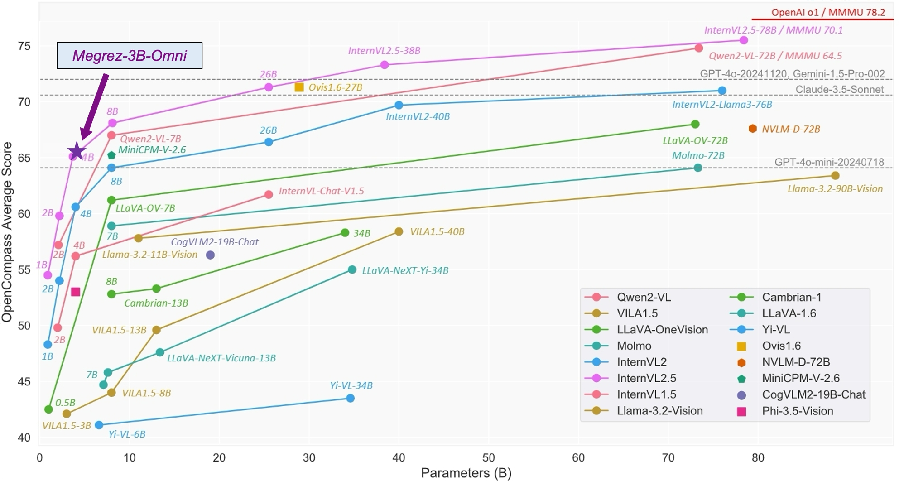

<div align="center">

# Megrez-3B-Omni: 软硬协同释放无穹端侧智能

<p align="center">
    
<p>
<p align="center">
        🤗 <a href="https://huggingface.co/Infinigence/Megrez-3B-Omni">Huggingface</a>&nbsp&nbsp | &nbsp&nbsp🤖<a href="https://www.modelscope.cn/models/InfiniAI/Megrez-3B-Omni">Modelscope</a>&nbsp&nbsp | &nbsp&nbsp🖥️ <a href="https://huggingface.co/Infinigence/Megrez-3B-Omni">Demo</a>&nbsp&nbsp | &nbsp&nbsp📖 <a href="https://cloud.infini-ai.com/assets/png/wechat_official_account.1f7e61401727063822266.png">WeChat Official</a>&nbsp&nbsp | &nbsp&nbsp💬 <a href="https://cloud.infini-ai.com/assets/png/wechat_community.7dbbc0b51727063822266.png">WeChat Groups</a>&nbsp&nbsp
</p>

<strong>中文 | [English](./README.md)</strong>

</div>

## 模型简介

**Megrez-3B-Omni** 是由无问芯穹（[Infinigence AI](https://cloud.infini-ai.com/platform/ai)）研发的**端侧全模态**理解模型，基于无问大语言模型Megrez-3B-Instruct扩展，同时具备图片、文本、音频三种模态数据的理解分析能力，在三个方面均取得最优精度

- 在图像理解方面，基于 SigLip-400M 构建图像Token，在 OpenCompass 榜单上（综合8个主流多模态评测基准）平均得分66.2，超越 LLaVA-NeXT-Yi-34B 等更大参数规模的模型。Megrez-3B-Omni也是在MME、MMMU、OCRBench等多个主流测试集上目前精度最高的图像理解模型之一，在场景理解、OCR等方面具有良好表现。
- 在语言理解方面，Megrez-3B-Omni 并未牺牲模型的文本处理能力，综合能力较单模态版本（Megrez-3B-Instruct）精度变化小于2%，保持在C-EVAL、MMLU (Pro）、AlignBench等多个测试集上的最优精度优势，依然取得超越上一代14B模型的能力表现
- 在语音理解方面，采用Whisper-large-v3的Encoder作为语音输入，支持中英文语音输入及多轮对话，支持对输入图片的语音提问，根据语音指令直接响应文本，在多项基准任务上取得了领先的结果

?????
放一下雷达图和精度散点图？？？？然后写一句详细精度见hf，下面主要写部署

留一个视频或者gif demo的空位

环境版本那里highlight一下，注明其他版本存在风险，有问题提issue

gradio demo放一个效果图

## 基础信息

<table>
  <thead>
    <tr>
      <th></th>
      <th>Language Module</th>
      <th>Vision Module</th>
      <th>Audio Module</th>
    </tr>
  </thead>
  <tbody>
    <tr>
      <td>架构</td>
      <td>Llama-2 with GQA</td>
      <td>siglip-so400m</td>
      <td>Whisper-large-v3
(encoder-only)</td>
    </tr>
    <tr>
      <td># Params (Backbone)</td>
      <td>2.29B</td>
      <td>0.42B</td>
      <td>0.64B</td>
    </tr>
    <tr>
      <td>Connector</td>
      <td>-</td>
      <td>Cross Attention</td>
      <td>Linear</td>
    </tr>
    <tr>
      <td># Params (Others)</td>
      <td>Emb: 0.31B<br>Softmax: 0.31B</td>
      <td>Connector: 0.036B</td>
      <td>Connector: 0.003B</td>
    </tr>
    <tr>
      <td># Params (Total)</td>
      <td colspan="3">4B</td>
    </tr>
    <tr>
      <td># Vocab Size</td>
      <td>122880</td>
      <td>64 tokens/slice</td>
      <td>-</td>
    </tr>
    <tr>
      <td>Context length</td>
      <td colspan="3">4K tokens</td>
    </tr>
    <tr>
      <td>Supported languages</td>
      <td colspan="3">Chinese & English</td>
    </tr>
  </tbody>
</table>

### 图片理解能力



|         model         |       basemodel       |  发布时间  | TF参数量（B） | 总参数量（B) | OpenCompass (在线) |   MME   | MMMU val |   OCRBench | Math-Vista-Mini | RealWorldQA | MMVet | hallusionBench | MMB TEST(en) | MMB TEST(zh) | TextVQA val | AI2D_TEST | MMstar | DocVQA_TEST |
|:---------------------:|:---------------------:|:----------:|:-------------:|:------------:|:------------------:|:-------:|:--------:|:----------:|:---------------:|:-----------:|:-----:|:--------------:|:------------:|:------------:|:-----------:|:---------:|:------:|:-----------:|
|     Megrez-3B-Omni    |       Megrez-3B       | 2024.12.16 |      2.29     |     3.376    |        65.5        | 2315.41 |   51.89  |    82.8    |        62       |    71.89    |  54.5 |      50.12     |     80.8     |     82.3     |     80.3    |   82.05   |  60.46 |    91.62    |
|         GPT-4o        |           -           | 2024.08.06 |       -       |       -      |        71.5        |  2328.7 |   69.2   |     736    |       61.3      |     75.4    |  69.1 |       55       |       -      |       -      |      -      |    84.6   |    -   |     92.8    |
|      GPT-4o mini      |           -           | 2024.08.06 |       -       |       -      |        64.1        |  2003.4 |    60    |     785    |       52.4      |     67.1    |  66.9 |      46.1      |       -      |       -      |      -      |    77.8   |    -   |      -      |
|  Qwen2-VL-2B-Instruct |       Qwen2-1.5B      | 2024.08.28 |      1.31     |     2.21     |        57.2        |   1872  |   41.1   |     794    |        43       |     62.9    |  49.5 |      41.7      |     74.9     |     73.5     |     79.7    |    74.7   |   48   |     90.1    |
|     InternVL2.5-2B    | Internlm2.5-1.8B-chat | 2024.12.06 |      1.89     |     2.21     |        59.9        |  2138.2 |   43.6   |     804    |       51.3      |     60.1    |  60.8 |      42.6      |     74.7     |     71.9     |     74.3    |    74.9   |  53.7  |     88.7    |
|      BlueLM-V-3B      |           -           | 2024.11.29 |      2.7      |      3.1     |        66.1        |    -    |   45.1   |     829    |       60.8      |     66.7    |  61.8 |       48       |      83      |     80.5     |     78.4    |    85.3   |  62.3  |     87.8    |
|     InternVL2.5-4B    |  Qwen2.5-3B-Instruct  | 2024.12.06 |      3.09     |     3.71     |        65.1        |  2337.5 |   52.3   |     828    |       60.5      |     64.3    |  60.6 |      46.3      |     81.1     |     79.3     |     76.8    |    81.4   |  58.3  |     91.6    |
|     Baichuan-Omni     |       Unknown-7B      | 2024.10.11 |       7       |       7      |          -         |  2186.9 |   47.3   |     700    |       51.9      |     62.6    |  65.4 |      47.8      |     76.2     |     74.9     |     74.3    |     -     |    -   |      -      |
|     MiniCPM-V-2.6     |        Qwen2-7B       | 2024.08.06 |      6.5      |      8.1     |        65.2        |  2348.4 |   49.8   |     852    |       60.6      |     69.7    |   60  |      48.1      |     81.2     |      79      |     80.1    |    82.1   |  57.26 |     90.8    |
|  Qwen2-VL-7B-Instruct |        Qwen2-7B       | 2024.08.28 |      6.5      |     8.29     |         67         |  2326.8 |   54.1   |     845    |       58.2      |     70.1    |   62  |      50.6      |      83      |     80.5     |     84.3    |     83    |  60.7  |     94.5    |
|  MiniCPM-Llama3-V-2.5 |   Llama3-Instruct 8B  | 2024.05.20 |       8       |     8.54     |        58.8        |  2024.6 |   45.8   |     725    |       54.3      |     63.5    |  52.8 |      42.4      |     77.2     |     74.2     |     76.6    |    78.4   |    -   |     84.8    |
|          VITA         |      Mixtral 8x7B     | 2024.08.12 |      12.9     |     12.9     |          -         |   2097  |   47.3   |     678    |       44.9      |      59     |  41.6 |      39.7      |     74.7     |     71.4     |     71.8    |     -     |    -   |      -      |
|       GLM-4V-9B       |        GLM-4-9B       | 2024.06.04 |      8.2      |     13.9     |        59.1        |  2018.8 |   46.9   |     776    |       51.1      |      -      |   58  |      46.6      |     81.1     |     79.4     |      -      |    81.1   |  58.7  |      -      |
|   LLaVA-NeXT-Yi-34B   |         Yi-34B        | 2024.01.18 |       34      |      34      |         55         |  2006.5 |   48.8   |     574    |       40.4      |      66     |  50.7 |      34.8      |     81.1     |      79      |     69.3    |    78.9   |  51.6  |      -      |
| Qwen2-VL-72B-Instruct |       Qwen2-72B       | 2024.08.28 |     70.21     |     73.4     |        74.8        |  2482.7 |   64.5   |     877    |       70.5      |     77.8    |   74  |      58.1      |     86.5     |     86.6     |     85.5    |    88.1   |  68.3  |     96.5    |

### 文本处理能力

|                       |          |             |                                       | 对话&指令 |                 |        | 中文&英文任务 |            |       |          |  代码任务 |       | 数学任务 |       |
|:---------------------:|:--------:|:-----------:|:-------------------------------------:|:---------:|:---------------:|:------:|:-------------:|:----------:|:-----:|:--------:|:---------:|:-----:|:--------:|:-----:|
|         models        | 指令模型 |   发布时间  | Transformer参数量 （不含emb&softmax） |  MT-Bench | AlignBench (ZH) | IFEval |  C-EVAL (ZH)  | CMMLU (ZH) | MMLU  | MMLU-Pro | HumanEval |  MBPP |   GSM8K  |  MATH |
| Megrez-3B-Omni        |     Y    |  2024.12.16 |                  2.3                  |    8.4    |       6.5       |  66.5  |     84.0      |    75.3    | 73.3  |   45.2   |   72.6    | 60.6  |   63.8   | 27.3  |
| Megrez-3B-Instruct    |     Y    |  2024.12.16 |                  2.3                  |   8.64    |      7.06       |  68.6  |     84.8      |    74.7    | 72.8  |   46.1   |   78.7    | 71.0  |   65.5   | 28.3  |
| Baichuan-Omni         |     Y    |  2024.10.11 |                  7.0                  |     -     |        -        |    -   |     68.9      |    72.2    |  65.3 |     -    |     -     |   -   |     -    |   -   |
| VITA                  |     Y    |  2024.08.12 |                 12.9                  |     -     |        -        |    -   |     56.7      |    46.6    | 71.0  |     -    |     -     |   -   |   75.7   |   -   |
| Qwen1.5-7B            |          |  2024.02.04 |                  6.5                  |     -     |        -        |    -   |     74.1      |    73.1    | 61.0  |   29.9   |   36.0    | 51.6  |   62.5   | 20.3  |
| Qwen1.5-7B-Chat       |     Y    |  2024.02.04 |                  6.5                  |   7.60    |      6.20       |    -   |     67.3      |      -     | 59.5  |   29.1   |   46.3    | 48.9  |   60.3   | 23.2  |
| Qwen1.5-14B           |          |  2024.02.04 |                 12.6                  |     -     |        -        |    -   |     78.7      |    77.6    | 67.6  |     -    |   37.8    | 44.0  |   70.1   | 29.2  |
| Qwen1.5-14B-Chat      |     Y    |  2024.02.04 |                 12.6                  |    7.9    |        -        |    -   |       -       |      -     |   -   |     -    |     -     |   -   |     -    |   -   |
| Qwen2-7B              |          |  2024.06.07 |                  6.5                  |     -     |        -        |    -   |     83.2      |    83.9    | 70.3  |   40.0   |   51.2    | 65.9  |   79.9   | 44.2  |
| Qwen2-7b-Instruct     |     Y    |  2024.06.07 |                  6.5                  |   8.41    |      7.21       |  51.4  |     80.9      |    77.2    | 70.5  |   44.1   |   79.9    | 67.2  |   85.7   | 52.9  |
| Qwen2.5-3B-Instruct   |     Y    |  2024.9.19  |                  2.8                  |     -     |        -        |    -   |       -       |      -     |   -   |   43.7   |   74.4    | 72.7  |   86.7   | 65.9  |
| Qwen2.5-7B            |          |  2024.9.19  |                  6.5                  |     -     |        -        |    -   |       -       |      -     | 74.2  |   45.0   |   57.9    | 74.9  |   85.4   | 49.8  |
| Qwen2.5-7B-Instruct   |     Y    |  2024.09.19 |                  6.5                  |   8.75    |        -        |  74.9  |       -       |      -     |   -   |   56.3   |   84.8    | 79.2  |   91.6   | 75.5  |
| Llama-3.1-8B          |          |  2024.07.23 |                  7.0                  |    8.3    |       5.7       |  71.5  |     55.2      |    55.8    | 66.7  |   37.1   |     -     |   -   |   84.5   | 51.9  |
| Llama-3.2-3B          |          |  2024.09.25 |                  2.8                  |     -     |        -        |  77.4  |       -       |      -     | 63.4  |     -    |     -     |   -   |   77.7   | 48.0  |
| Phi-3.5-mini-instruct |     Y    |  2024.08.23 |                  3.6                  |    8.6    |       5.7       |  49.4  |     46.1      |    46.9    | 69.0  |   47.4   |   62.8    | 69.6  |   86.2   | 48.5  |
| MiniCPM3-4B           |     Y    |  2024.09.05 |                  3.9                  |   8.41    |      6.74       |  68.4  |     73.6      |    73.3    | 67.2  |     -    |   74.4    | 72.5  |   81.1   | 46.6  |
| Yi-1.5-6B-Chat        |     Y    |  2024.05.11 |                  5.5                  |   7.50    |      6.20       |    -   |     74.2      |    74.7    | 61.0  |     -    |   64.0    | 70.9  |   78.9   | 40.5  |
| GLM-4-9B-chat         |     Y    |  2024.06.04 |                  8.2                  |   8.35    |      7.01       |  64.5  |     75.6      |    71.5    | 72.4  |     -    |   71.8    |   -   |   79.6   | 50.6  |
| Baichuan2-13B-Base    |          |  2023.09.06 |                 12.6                  |     -     |      5.25       |    -   |     58.1      |    62.0    | 59.2  |     -    |   17.1    | 30.2  |   52.8   | 10.1  |

- Qwen2-1.5B模型的指标在论文和Qwen2.5报告中点数不一致，当前采用原始论文中的精度

### 语音理解能力

|       Model      |     Base model     | Realease Time | Fleurs test-zh | WenetSpeech test_net | WenetSpeech test_meeting |
|:----------------:|:------------------:|:-------------:|:--------------:|:--------------------:|:------------------------:|
| Whisper-large-v3 |          -         |   2023.11.06  |      12.4      |         17.5         |           30.8           |
|  Qwen2-Audio-7B  |      Qwen2-7B      |   2024.08.09  |        9       |          11          |           10.7           |
|  Baichuan2-omni  |     Unknown-7B     |   2024.10.11  |        7       |          6.9         |            8.4           |
|       VITA       |    Mixtral 8x7B    |   2024.08.12  |        -       |      -/12.2(CER)     |        -/16.5(CER)       |
|  Megrez-3B-Omni  | Megrez-3B-Instruct |   2024.12.16  |      10.8      |         45.08        |           16.44          |

### 速度

|                | image_tokens | prefill (tokens/s) | decode (tokens/s) |
|----------------|:------------:|:------------------:|:-----------------:|
| Megrez-3B-Omni |      448     |       6312.66      |       1294.9      |
| Qwen2-VL-2B    |     1378     |       7349.39      |       685.66      |
| MiniCPM-V-2_6  |      448     |       2167.09      |       452.51      |

实验设置：

- 测试环境为NVIDIA H100下VLLM下输入128个Text token和一张 720*1480的图片，输出128个token，num_seqs固定为8。
- Qwen2-VL-2B的在此实验下的decode速度小于Megrez-3B-Omni，虽然其具备更小的基座LLM，但是编码上述大小图片后的image_token相较Megrez-3B-Omni较多，影响实际推理速度。

## 安装

使用如下命令安装依赖：

```shell
pip install -r requirements.txt
```

## 微调模型

我们提供了一个基于 [DeepSpeed](https://github.com/microsoft/DeepSpeed) 和 [accelerate](https://github.com/huggingface/accelerate) 的[微调示例](./finetune/)。

### 数据准备

我们基于[ALLaVA-4V/allava_laion](https://huggingface.co/datasets/FreedomIntelligence/ALLaVA-4V/tree/main/allava_laion)构造了一个示例数据集：

- **对话**：[data/train/records.jsonl](./data/train/records.jsonl)
- **图片**：[data/train/images](./data/train/images)
- **音频**：[data/train/audio](./data/train/audio)，是通过将对话中的文本使用TTS转换为语音得到的。

您也可以按照上述格式准备自己的数据集。

### 依赖安装

```shell
pip install deepspeed accelerate
```

### 全参微调

使用如下命令运行我们的微调示例，请注意将脚本中的模型路径替换成您下载的模型路径。

```shell
cd finetune

sh finetune.sh
```

您可以通过设置`tune_vision_encoder`、`tune_vision_proj`、`tune_llm`、`tune_audio_encoder`、`tune_audio_proj`来选择需要微调的模块。

### 注意事项

- 推荐使用至少2张拥有80G显存的GPU进行微调。
- 在显存不足的情况下：
  - 请尝试调整`model_max_length`和`per_device_train_batch_size`。
  - 请尝试关闭需要微调的模块以便减少显存占用。
  - 请尝试调整deepspeed的`zero_optimization`参数来优化显存使用。

## 推理

### 使用多模态数据进行多轮对话

请使用如下脚本进行推理。请将 `PATH_TO_PRETRAINED_MODEL` 替换为下载的模型权重的路径。

```python
import torch
from transformers import AutoModelForCausalLM

path = "{{PATH_TO_PRETRAINED_MODEL}}"  # 更改为模型的路径

model = (
    AutoModelForCausalLM.from_pretrained(
        path,
        trust_remote_code=True,
        torch_dtype=torch.bfloat16,
    )
    .eval()
    .cuda()
)

messages = [
    {
        "role": "user",
        "content": {
            "text": "Please describe the content of the image.",
            "image": "./data/sample_image.jpg",
        },
    },
]

MAX_NEW_TOKENS = 100
response = model.chat(
    messages,
    sampling=False,
    max_new_tokens=MAX_NEW_TOKENS,
)
print(response)
```

完整的示例见：[example_chat_hf.py](example_chat_hf.py).

### 使用 vLLM 进行推理

我们提供了一个基于 vLLM 框架的推理参考实现。您可以在 [vllm_demo/megrezo.py](vllm_demo/megrezo.py) 中找到模型定义。

推理步骤如下：

1. 安装 vLLM

注意，我们需要安装特定版本的依赖：

```shell
pip install vllm==0.6.3.post1 flash_attn==2.5.8 xformers==0.0.27.post2
```

2. 运行推理脚本

vLLM 尚未正式支持 MegrezO，因此您需要先导入我们定义的模块：

```python
from vllm import ModelRegistry
from megrezo import MegrezOModel

ModelRegistry.register_model("MegrezO", MegrezOModel)
```

然后，您可以使用以下代码运行推理：

```python
from PIL import Image
from vllm import LLM
from vllm import SamplingParams


model_path = "{{PATH_TO_HF_PRETRAINED_MODEL}}"  # 更改为模型的路径
llm = LLM(
    model_path,
    trust_remote_code=True,
    gpu_memory_utilization=0.5,
)

sampling_params = SamplingParams(
    temperature=0,
    max_tokens=1000,
    repetition_penalty=1.2,
    stop=["<|turn_end|>", "<|eos|>"],
)

img = Image.open("../data/sample_image.jpg")

conversation = [
    {
        "role": "user",
        "content": {
            "text": "图片的内容是什么？",
            "image": img,
        },
    },
]

# 将对话转换为 vLLM 可接受的格式。
prompt = llm.get_tokenizer().apply_chat_template(
    conversation,
    tokenize=False,
    add_generation_prompt=True,
)
vllm_inputs = [
    {
        "prompt": prompt,
        "multi_modal_data": {
            "image": img,
        },
    }
]

# 生成输出
outputs = llm.generate(
    vllm_inputs,
    sampling_params,
)

# 打印输出
for output in outputs:
    print(output.outputs[0].text)
```

完整的示例见：[vllm_demo/example_infer_vllm.py](vllm_demo/example_infer_vllm.py).

## 使用 Gradio 与 MegrezO 对话

我们提供基于 Hugging Face Gradio <a href='https://github.com/gradio-app/gradio'></a> 实现的在线和本地 Demo。

### 在线 Demo

欢迎试用在线 Demo: {{TBD}}。

### 本地 Demo
  
使用如下命令部署本地 Gradio 应用：

1. 安装依赖:

```shell
pip install -r requirements.txt
```

2. 启动 Gradio 应用

您需要在命令行中指定 `model_path` 和 `port`。`model_path` 是模型的路径，`port` 是本地服务器的端口号。默认情况下，`port` 是 `7860`。

```shell
python gradio_app.py --model_path {model_path} --port {port}
```

然后，您可以在浏览器中访问 `http://localhost:7860` 与模型对话。

如需自定义输入和输出接口，请修改 `gradio_app.py`。更多信息请参考 [Gradio 文档](https://gradio.app/docs)。

## 开源协议及使用声明

- **协议**：本仓库中代码依照 [Apache-2.0](https://www.apache.org/licenses/LICENSE-2.0) 协议开源
- **幻觉**：大模型天然存在幻觉问题，用户使用过程中请勿完全相信模型生成的内容。若用户想获取更符合事实的生成内容，推荐利用我们的WebSearch功能，详见 [xxxx]。
- **数学&推理**：小模型在数学和推理任务上更容易出错误的计算过程或推理链条，从而导致最终结果错误。特别的，小模型的输出softmax分布相比大模型明显不够sharp，在较高temperature下更容易出现多次推理结果不一致的问题，在数学/推理等确定性问题上更为明显。我们推荐在这类问题上，调低temperature，或尝试多次推理验证。
- **System Prompt**：和绝大多数模型一样，我们推荐使用配置文件中chat_template默认的system prompt，以获得稳定和平衡的体验。本次模型发布弱化了角色扮演等涉及特定领域应用方面的能力，用户若有特定领域的应用需求，我们推荐在本模型基础上按需进行适当微调。
- **价值观及安全性**：本模型已尽全力确保训练过程中使用的数据的合规性，但由于数据的大体量及复杂性，仍有可能存在一些无法预见的问题。如果出现使用本开源模型而导致的任何问题，包括但不限于数据安全问题、公共舆论风险，或模型被误导、滥用、传播或不当利用所带来的任何风险和问题，我们将不承担任何责任。

## 联系我们


